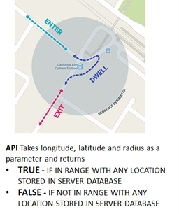
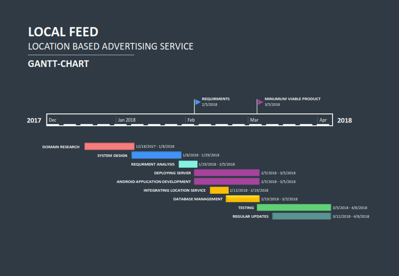
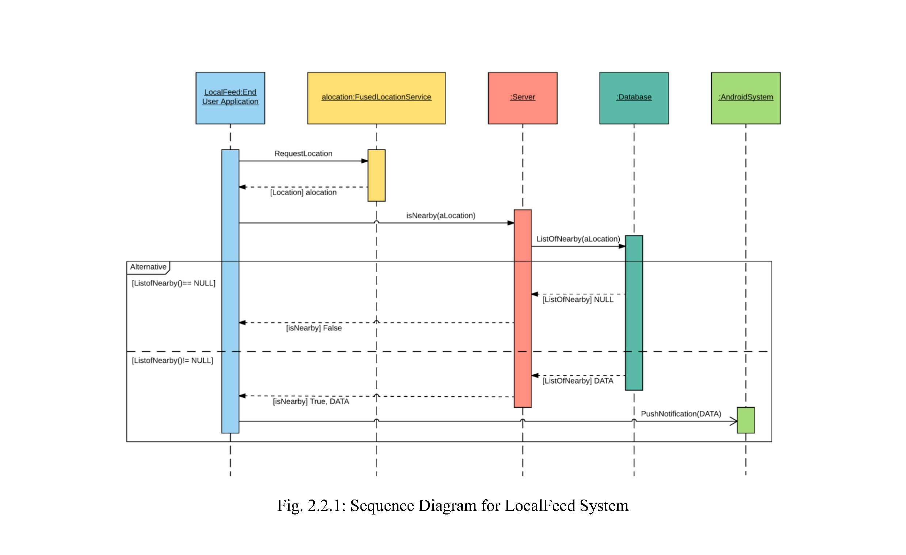
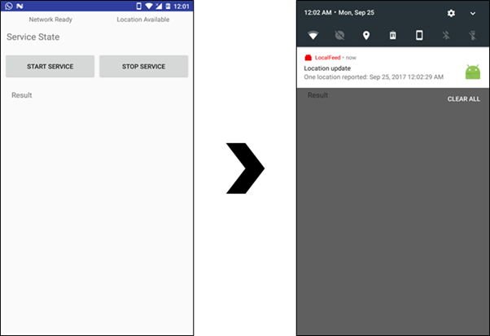

# Location-Based Advertising Service - Project Overview

  
<em>The Location-Based Advertising Service is a project that aims to improve the sales and marketing strategies of businesses by leveraging location-based notifications to attract potential customers. The implementation of this service involves the use of a notification server and a location gatherer, working in sync, to push relevant notifications to users' devices whenever they pass by a listed shop. By presenting users with timely and location-specific offers, this approach intends to increase customer engagement and boost sales compared to traditional methods where promotional information is received when users are least interested.</em>

## Utilizations in Marketing and Advertising

Location-based advertising has become a powerful marketing strategy with proven effectiveness in driving sales and increasing customer engagement. Here are some key utilizations of the Location-Based Advertising Service in marketing and advertising:

1. **Personalization**: The service tailors customized messages and offers to users based on their geographical location. This personalization creates a more relevant and engaging advertising experience, increasing the chances of attracting potential customers to visit the listed shops.

2. **Precise Timing**: By utilizing real-time location data, the service can deliver notifications to users precisely when they are in proximity to a shop. This timely delivery of offers increases the likelihood of users changing their directions and visiting the shop immediately.

3. **Geotargeting and Geofencing**: Geotargeting enables businesses to target specific audiences based on their location, ensuring that offers reach the right potential customers. Geofencing allows businesses to set virtual perimeters around their shops, triggering notifications when users enter the designated area.

4. **Hyper-Contextual Targeting**: The service can analyze users' location history and behavior to understand their preferences and interests. This hyper-contextual targeting ensures that the offers presented are highly relevant to users, increasing the chances of conversion.

5. **Increased Foot Traffic**: By sending push notifications to potential customers nearby, the service encourages immediate store visits. This is particularly beneficial for brick-and-mortar businesses that rely on physical store visits for sales.

6. **Versatility**: The Location-Based Advertising Service can be applied across various industries and business sizes, providing an effective marketing tool for both large and small businesses.

7. **Insights and Analytics**: The service can gather data on user behavior, response rates, and conversion metrics, providing valuable insights for businesses to optimize their advertising campaigns.

## Project Structure

The project is divided into several sections:

1. **Introduction**: Provides an overview of the project, its objectives, and the implementation of the location-based advertising service.

2. **Problem Statement**: Describes the marketing challenge the project aims to solve - attracting potential customers and converting them into paying customers.

3. **Solution**: Explains how the location-based advertising service addresses the problem by delivering personalized notifications to users based on their location.

4. **Comparison with Traditional Methods**: Compares the effectiveness of location-based advertising with traditional advertising methods, emphasizing the benefits of targeted and timely offers.

5. **Results**: Presents the results achieved through the implementation of the location-based advertising service, including increased foot traffic, engagement rates, and sales.

## Screenshots

## Results Achieved

the Location-Based Advertising Service has demonstrated promising results. It has significantly increased user engagement when recieved a notification. The personalized and timely notifications have proven to be more effective in attracting potential customers and converting them into paying customers.

