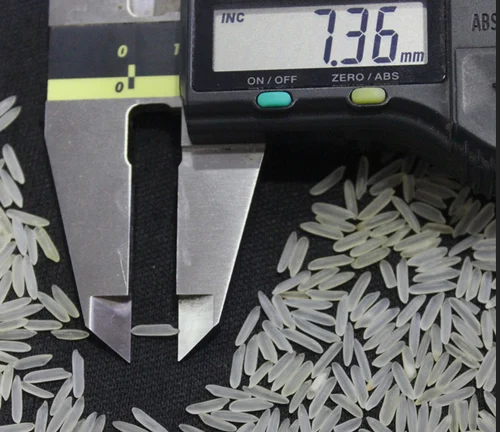

# Rice Quality Analysis using OpenCV

## Overview

This project aims to automate the process of analyzing rice quality by measuring the physical properties of rice grains using image processing techniques with OpenCV. The traditional method involved manual measurement using a Vernier by a lab expert, but the new approach utilizes a Django-based Image processing tool that employs OpenCV to analyze scanned images of rice samples and calculate the length of each grain to find the average length of the sample with increased accuracy.

## Traditional Approach

In the traditional approach, the process of analyzing rice quality was carried out manually by a lab expert. The expert would take a sample of rice grains and measure the length of each grain using a Vernier caliper. After measuring the length of each grain, they would then calculate the average length of the rice sample. However, this method was time-consuming and prone to human errors, leading to an accuracy of approximately 95%.

## New Approach

To overcome the limitations of the traditional approach and improve the accuracy, a new Django-based Image processing tool was developed using OpenCV, numpy, and matplotlib in Python. The new approach follows these steps:

1. Scanning the Rice Sample: The first step involves scanning the rice sample to obtain a digital image that contains the rice grains.

2. Image Preprocessing: The scanned image undergoes preprocessing using OpenCV techniques to enhance the image quality, remove noise, and improve the clarity of the rice grains.

3. Grain Length Measurement: Once the preprocessing is completed, the tool utilizes image processing algorithms to detect and measure the length of each rice grain in the image accurately.

4. Average Length Calculation: After measuring the length of all individual rice grains, the tool calculates the average length of the entire rice sample.

5. Results Visualization: The final step involves visualizing the results, including the average length of the rice sample, and displaying the processed image with annotated grain lengths.

## Conclusion

The rice quality analysis tool presented in this repository offers a significant improvement over the traditional manual approach. By utilizing image processing techniques with OpenCV, the accuracy of the measurement has been increased to approximately 98%. Researchers, rice farmers, and grain quality inspectors can benefit from this automated and efficient tool to assess rice grain properties accurately and consistently.
