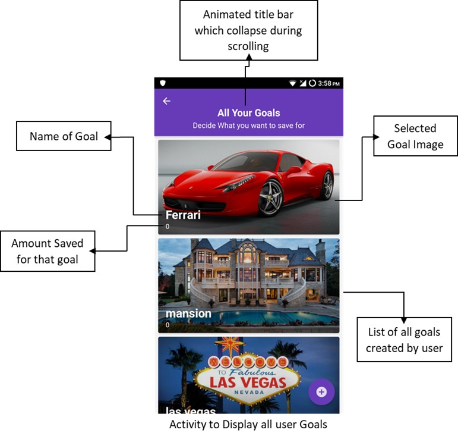
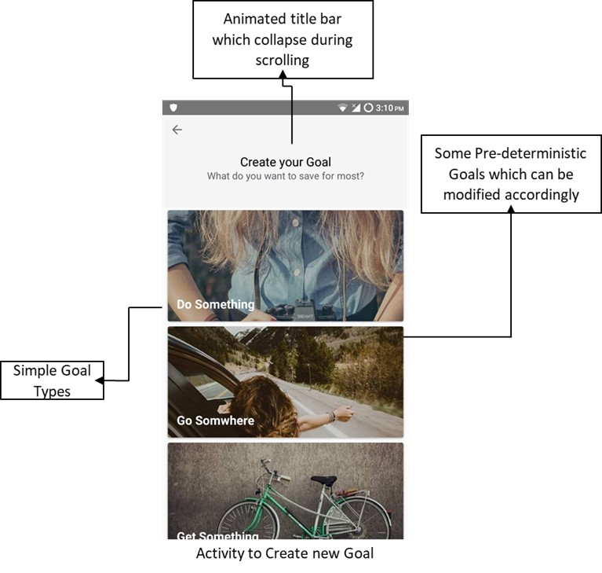
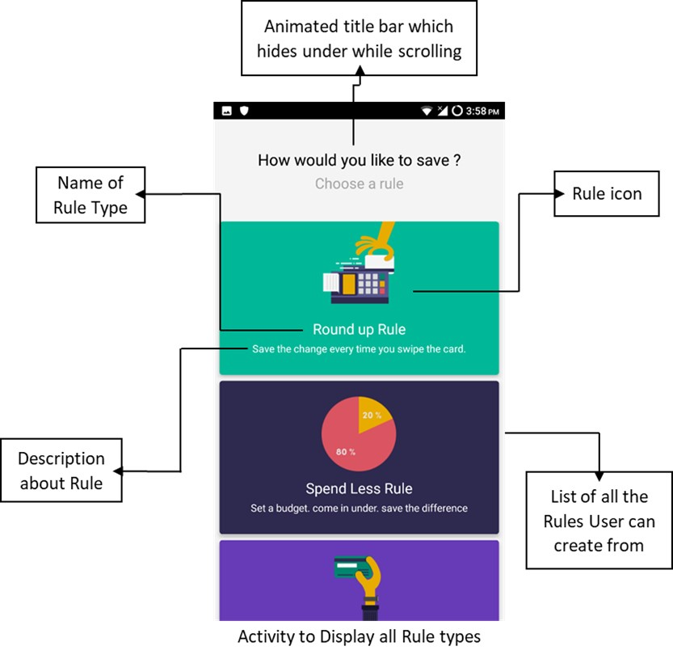
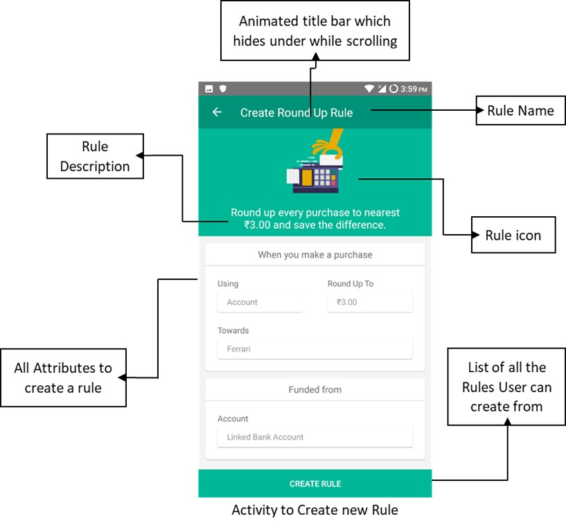

# Capitally - Finance Application

Capitally is a powerful finance application designed to empower individuals in achieving their financial goals by providing easy access and management of multiple accounts. With its diverse set of features, Capitally offers users a comprehensive platform to take control of their finances and make informed decisions.

## Key Features

#### 1. Mobile Banking
Capitally offers users a consolidated view of all their account details in one place. It simplifies the management of multiple accounts by providing an intuitive interface to handle transfers and monitor spending effectively.

#### 2. Financial Insights
To promote better financial habits, Capitally keeps track of user spending patterns and categorizes expenses accordingly. This valuable insight enables users to identify areas for improvement and make informed budgeting decisions.

#### 3. Automated Savings
Capitally introduces a seamless way to save money automatically without causing account shortages. Users can define triggers that initiate deposits and set the desired amount for automatic savings.

#### 4. Saving Goals
Setting and achieving financial goals becomes effortless with Capitally. Users can define their savings goals, and the app will automatically allocate funds towards these goals, ensuring progress is made consistently.

#### 5. Security
Capitally prioritizes the security of user data and transactions. To maintain confidentiality, integrity, and privacy, the application employs advanced 128-bit ENCRYPTION, similar to the security measures adopted by banks.

## My Contribution
I get an opportunity to work on one of its feature called Automated Savings. Using this feature user can automate his/her savings without getting out of cash.
Within this feature user can setup his/her goals (for what he/she wanted save for) and saving rules (when, how much and from where to save money), Multiple rules can be used to save for particular goal and multiple goals can be ruled by single rule. It is a many to many relationship. This is a unique feature into capitally even one of the core feature of the application.

## RESULT:

The project "Automated Savings" has been successfully implemented as a module in the "Capitally" app. The goal of this project was to provide users with a feature that automates their savings according to their defined goals.

### Goals:

To achieve the goal of automating savings for users, we have created an activity within the app where users can view and manage all their previously set goals. Additionally, they have the option to create new goals as needed. To store and preserve user settings and data, we utilized a local SQLite database on Android devices.

  
  

### Rules:

To facilitate automated savings, we have developed an intuitive user interface that enables users to create custom rules based on pre-existing basic rules. These rules act as guidelines, specifying when, how much, and from where the funds should be saved to reach their respective goals. It is essential for each rule to be associated with at least one goal to save for; otherwise, the rule will be marked as paused.

  
  

Overall, the "Automated Savings" module is designed to provide users with an efficient and personalized way to achieve their financial objectives by automating the savings process and offering them flexibility in defining their goals and rules. The incorporation of a local SQLite database ensures that user data is securely stored and can be accessed on their Android devices.

##Conclusion
The Automated Savings feature is a powerful and distinctive aspect of Capitally, providing users with the tools to make saving money seamless and efficient. With the ability to set up customized rules for multiple goals, users can confidently work towards their financial aspirations without the burden of manual savings management.

By incorporating Automated Savings into their financial journey, Capitally users are empowered to take charge of their finances and build a stronger foundation for a financially secure future.
